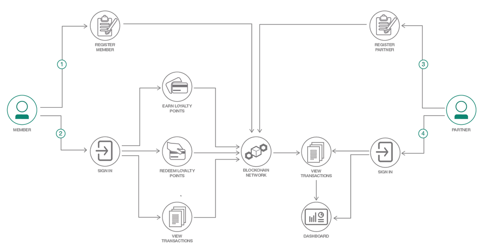
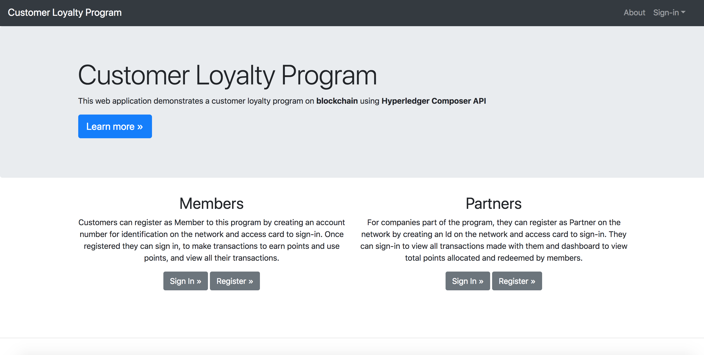

# Customer Loyalty Program with blockchain

A customer loyalty program allows companies to reward customers who frequently make purchases. Program members are able to earn points on purchases, which can translate into some type of reward such as discount, freebie or special customer treatment.  The members work toward a certain amount of points to redeem their reward.  These programs can have multiple companies as partners on the program, to cater to a customer base.  However, current loyalty program systems are restraint on relations between partners, and with visibility to members. These restraints can be removed by creating the customer loyalty program on a blockchain network.

This blockchain model for a customer loyalty program enhances the value of points to loyalty program members and brings in new value to the partners by creating trusted transactions. Participants in this network have a more level relation among each other and points are in the centric position to connect all participants.

In this code pattern, we will create a customer loyalty program as a blockchain web application using Hyperledger Composer API and Node.js. The application will allow members to register on the network where they will create their account.  They will be identified on the network with their account number and will create a access key which they will use to sign in.  This access key is used as the card id for the member to make transactions and query records.  The member once signed in, can make transactions to earn points and redeem points from the partners on the network. They can view their transactions as part of the blockchain ledger.  This code pattern illustrates the use of permissions as part of the network where a member can only view their transactions.

Similarly for the partner, they will register by creating an identity on the network and an access key which will be used to view their records.  Partners are allowed to view only transactions they were part of, and thus can keep track of all their transactions where they allocated or redeemed points.  The web application shows a basic dashboard for the partner displaying the total points that they have allocated and redeemed to members.  As transactions get complex, the partner can perform analysis on their transactions to create informative dashboards.

This code pattern is for developers looking to start building blockchain applications with Hyperledger Composer. When the reader has completed this code pattern, they will understand how to:

* Create basic business network using Hyperledger Composer framework
* Deploy the network to an instance of Hyperledger Fabric locally or on IBM Blockchain Starter Plan
* Build a Node.js web application to interact with the blockchain network using Composer API


# Architecture Flow

<p align="center">
  
</p>

**Note** The blockchain network will have multiple members and partners

1. Member is registered on the network
2. Member can sign-in to make transactions to earn points, redeem points and view their transactions
3. Partner is registered on the network
4. Partner can sign-in to view their transactions and display dashboard


# Included Components

* [Hyperledger Composer v0.19.4](https://hyperledger.github.io/composer/latest/) Hyperledger Composer is an extensive, open development toolset and framework to make developing blockchain applications easier
* [Hyperledger Fabric v1.1](https://hyperledger-fabric.readthedocs.io) Hyperledger Fabric is a platform for distributed ledger solutions, underpinned by a modular architecture delivering high degrees of confidentiality, resiliency, flexibility and scalability.
* [IBM Blockchain Starter Plan](https://console.bluemix.net/catalog/services/blockchain) The IBM Blockchain Platform Starter Plan allows to build and try out blockchain network in an environment designed for development and testing

## Featured technology
+ [Nodejs](https://www.python.org/) Node.js is an open-source, cross-platform JavaScript run-time environment that executes JavaScript code server-side
+ [Bootstrap](https://getbootstrap.com/) Bootstrap is an open source toolkit for developing with HTML, CSS, and JS


# Running the Application

Follow these steps to setup and run this code pattern. The steps are described in detail below.

## Prerequisite
- [npm](https://www.npmjs.com/)  (v5.x)
- [Node](https://nodejs.org/en/) (version 8.9 or higher - note version 9 is not supported)
* to install specific Node version you can use [nvm](https://davidwalsh.name/nvm)

  Example:
  + 1. `nvm install 8.9.4`
  + 2. `nvm use v8.9.4`
  + 3. Output `Now using node v8.9.4 (npm v6.1.0)`
- [Hyperledger Composer](https://hyperledger.github.io/composer/installing/development-tools.html)
  * to install composer cli
    `npm install -g composer-cli@0.19.4`
  * to install composer-rest-server
    `npm install -g composer-rest-server@0.19.4`
  * to install generator-hyperledger-composer
    `npm install -g generator-hyperledger-composer@0.19.4`

## Steps
1. [Clone the repo](#1-clone-the-repo)
2. [Generate the Business Network Archive](#2-generate-the-business-network-archive)
3. [Deploy Network](#3-deploy-network)
      - [Deploy to Fabric locally](./docs/deploy-local-fabric.md)
      - [Deploy to IBM Blockchain Starter Plan](./docs/deploy-ibm-starter.md)
4. [Run Application](#4-run-application)


## 1. Clone the repo

Clone the `Customer Loyalty Program with Blockchain` repo locally. In a terminal, run:

`git clone https://github.com/IBM/customer-loyalty-program`

## 2. Generate the Business Network Archive

Next we will generate the Business Network Archive (BNA) file from the root directory.  
This file will contain your network including:
- the model defined in the `org.clp.biznet.cto` file in the `models` folder
- the logic behind transactions in the `logic.js` file in the `lib` folder
- permissions defined in the `permissions.acl` file
- queries defined in the `queries.qry` file

Run the following the command to create the bna file:
```
cd customer-loyalty-program/
npm install
```

The `composer archive create` command in `package.json` has created a file called `clp-network@0.0.1.bna`.   


## 3. Deploy Network

The bna can be deployed to a local instance of Fabric or can use IBM Blockchain Starter Plan.

- [Deploy to Hyperledger Fabric locally](./docs/deploy-local-fabric.md)
- [Deploy to IBM Blockchain Starter Plan](./docs/deploy-ibm-starter.md)


## 4. Run Application

Go into the `web-app` folder and install the dependency:

```
cd web-app/
npm install
```

Start the application:
```
npm start
```

The application should now be running at:
`http://localhost:8000`

<div style='border: 2px solid #f00;'>
  
</div>
</br>

### Deploy application to IBM Cloud

If your hosting the network on IBM Blockchain Starter Plan, then you can [deploy the app to IBM Cloud](./docs/deploy-app-cloud.md).

## Links
* [Hyperledger Fabric Docs](http://hyperledger-fabric.readthedocs.io/en/latest/)
* [Hyperledger Composer Docs](https://hyperledger.github.io/composer/latest/introduction/introduction.html)
* [Demo on Youtube](https://youtu.be/nLHBmPQa_FY)

## License
[Apache 2.0](LICENSE)
