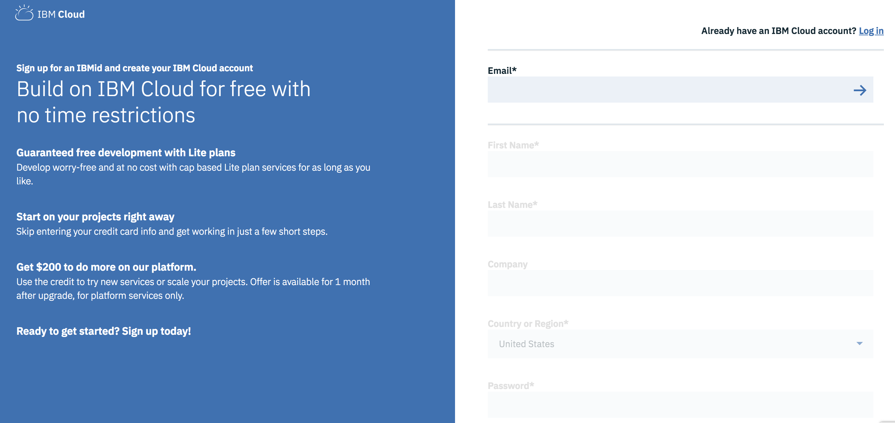
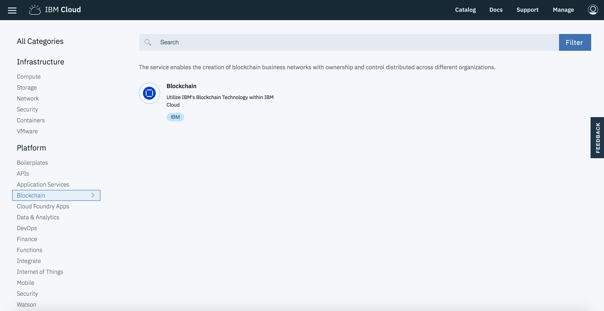
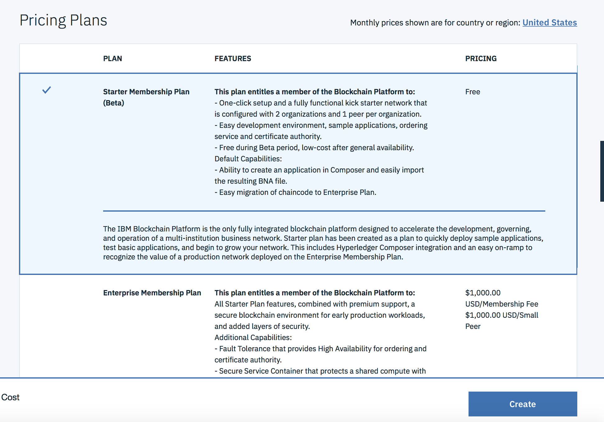
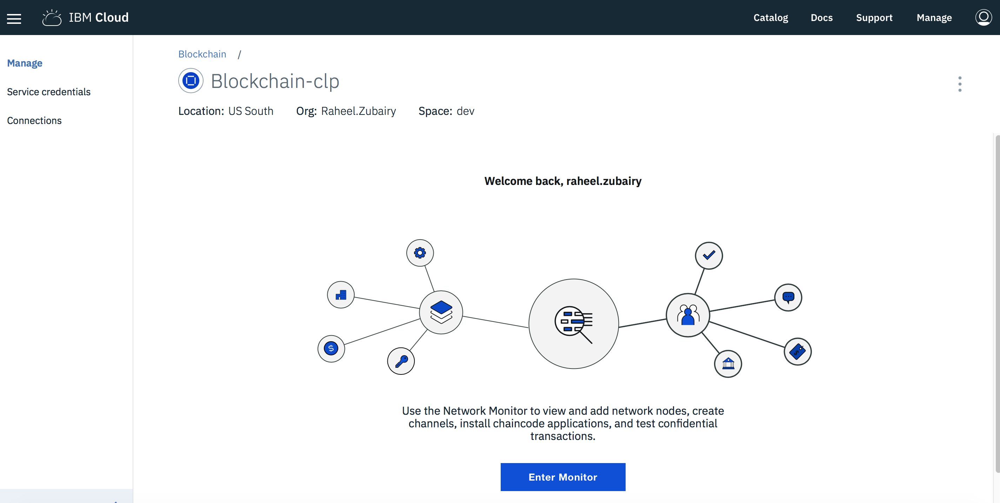
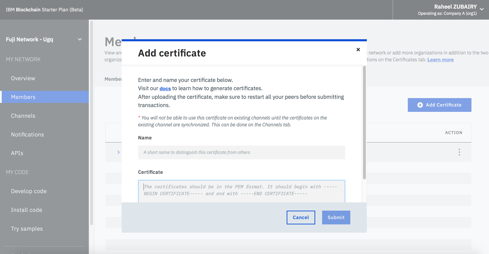
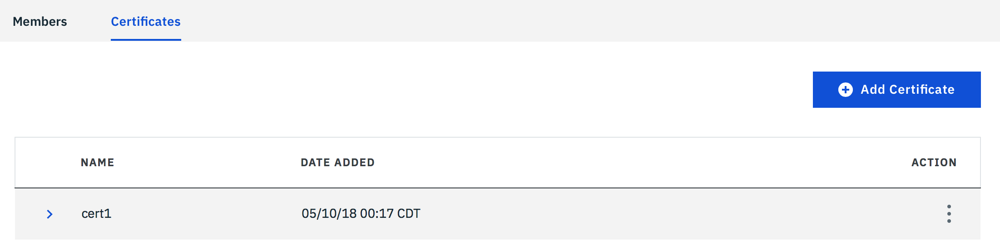

# Deploy to IBM Blockchain Starter Plan

In this section we will:
- [Create IBM Blockchain Starter Plan service](#create-ibm-blockchain-starter-plan-service)
- [Prepare a local Business Network card for Network Administration](#prepare-a-local-business-network-card-for-network-administration)
- [Uploading your Certificate to the Monitor](#uploading-your-certificate-to-the-monitor)
- [Deploying the Business Network Archive](#deploying-the-business-network-archive)
- [Create a Business network card which can interact with the deployed network](create-a-business-network-card-which-can-interact-with-the-deployed-network)


These steps follow the instructions presented in the guide [Deploying Hyperledger Composer Business Network to IBM Blockchain Platform Enterprise Plan on IBM Cloud](https://ibm-blockchain.github.io/platform-deployment/)

## Create IBM Blockchain Starter Plan service

Create the IBM Blockchain Starter Plan service in IBM Blockchain.  Ensure you have IBM account

* You can access IBM Cloud by going to https://console.bluemix.net/. If you do not have an IBM Cloud account you can create one.

<p align="center">
  
</p>

* If you do have an IBM Cloud account or have created on, then login to create the service.  You can find the service in `Catalog` and choose `Blochchain` from the menu.  Select `Blockchain`

<p align="center">
  
</p>

* Or alternatively can go directly to the [link here](https://console.bluemix.net/catalog/services/blockchain) to create the service.  Give your service a name and choose the `region`, `organization` and `space`.

<p align="center">
  
</p>

Choose the `IBM Blockchain Starter Plan`. And click `Create`.
**NOTE** This plan is free during beta period

<p align="center">
  
</p>

This service plan has been added to your IBM Cloud. In your blockchain service - choose `Enter Monitor`.

<p align="center">
  
</p>


## Prepare a local Business Network card for Network Administration

In the `Overview` section, click on `Connection Profile`.  In the pop up option, choose `Download`.

<p align="center">
  
</p>

The downloaded file contains a registrar element containing an enrollId and enrollSecret that is specific to your service/organization. For example:

```
"registrar": [
    {
        "enrollId": "admin",
        "enrollSecret": "PA55W0RD12"
    }
],
```

Make a note of `enrollId` and `enrollSecret` values as you will need them shortly.

Before starting, you can remove all composer cards with the following command.
```
rm -rf ~/.composer
```

Now in your terminal, run the following command to create a Composer business network card.

```
composer card create -p connection-profile.json -u <enrollID> -s <enroll-secret> -r PeerAdmin -r ChannelAdmin

```
View the card created:
```
composer card list
```

Make a note of this card name as it will be used for commands below as `<Your Card Name>`


Next, import the card into the card store.

```
composer card import -f <Your Card Name>
```

Now request an identity for the admin from the fabric Certificate Authority. The certificates will be stored in a `credentials` directory.

```
composer identity request --card <Your Card Name> ./credentials
```

Once you have the credentials created, you can delete the card as it may cause conflict error, when importing card using the credentials from the `credentials` folder.

```
composer card delete --card <Your Card Name>
```

You now need to create a new business network card containing the credentials issued from the identity request.

```
composer card create -f adminCard.card -p connection-profile.json -u admin -c ./credentials/admin-pub.pem -k ./credentials/admin-priv.pem --role PeerAdmin --role ChannelAdmin
```

Import the card.
```
composer card import -f adminCard.card
```
View the card created.
```
composer card list
```


## Uploading your Certificate to the Monitor

Next, we will upload the certificates created to our blockchain monitor.

* In your monitor, go to `Members` in the menu.  Select the `Certificates` tab, and click on `Add Certificate`.

<p align="center">
  
</p>

* Enter a unique name for this certificate (don’t use dashes in the name) in the `Name` field.

* Open the file `admin-pub.pem` in your `credentials` folder and copy the entire content of this file into the Key field and press the Submit button.


* Restart your peers by clicking OK when asked. Once created it should appear in the list of certificates.

<p align="center">
  
</p>

* Go to the `Channels` page from the navigation panel and from the 3-dot actions menu select the `Sync Certificate` option. This pulls the certificates just uploaded into the channel.

<p align="center">
  
</p>


## Deploying the Business Network Archive

Now you can deploy your .bna file to your IBM Blockchain Platform instance. Ensure you are in the same directory as the bna file.  To install the business network, run the following command:

```
composer network install --card <Your Card Name> --archiveFile clp-network@0.0.1.bna
```

To start the business network, run the following command:

```
composer network start --networkName clp-network --networkVersion 0.0.1 -c <Your Card Name> -A admin -C ./credentials/admin-pub.pem -f delete_me.card
```

## Create a Business network card which can interact with the deployed network

Now you need a Business network card that will allow you to interact on the deployed business network which can perform actions such as issue identities. To create the card issue the following command:

```
composer card create -n clp-network -p connection-profile.json -u admin -c ./credentials/admin-pub.pem -k ./credentials/admin-priv.pem
```

Import this card into the card store.

```
composer card import -f admin@clp-network.card
```

You can then test this card by doing.
```
composer network ping -c admin@clp-network
```

If the command returns successfully, your setup is complete.

Your ready to [run the application](../README.md#5-run-application)
